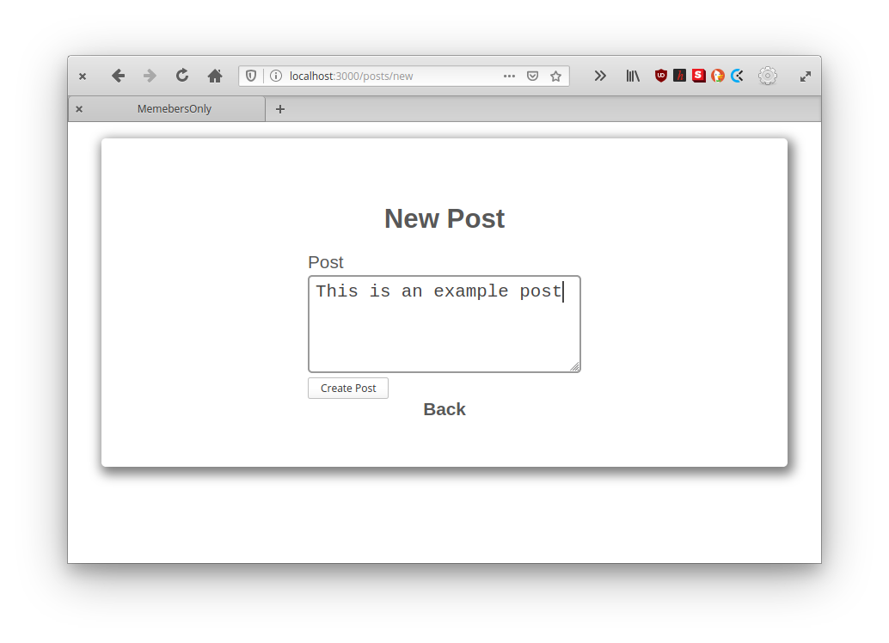
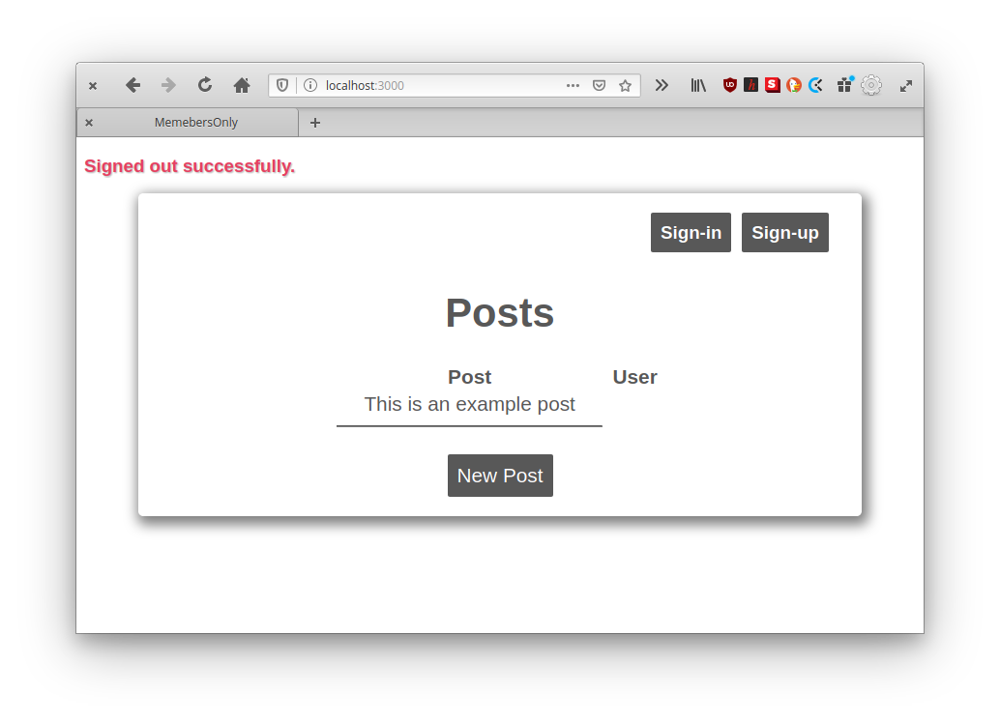

<!--
*** Thanks for checking out this README Template. If you have a suggestion that would
*** make this better, please fork the repo and create a pull request or simply open
*** an issue with the tag "enhancement".
*** Thanks again! Now go create something AMAZING! :D
-->

<!-- PROJECT SHIELDS -->
<!--
*** I'm using markdown "reference style" links for readability.
*** Reference links are enclosed in brackets [ ] instead of parentheses ( ).
*** See the bottom of this document for the declaration of the reference variables
*** for contributors-url, forks-url, etc. This is an optional, concise syntax you may use.
*** https://www.markdownguide.org/basic-syntax/#reference-style-links
-->
[![Contributors][contributors-shield]][contributors-url]
[![Forks][forks-shield]][forks-url]
[![Stargazers][stars-shield]][stars-url]
[![Issues][issues-shield]][issues-url]


<!-- PROJECT LOGO -->
<br />
<p align="center">
  <a href="https://github.com/rammazzoti2000/members-only">
    
  </a>

  <h3 align="center">Forms and Authentication -- [Members_Only]</h3>

  <p align="center">
    This project is part of the Microverse curriculum in Ruby on Rails module!
    <br />
    <a href="https://github.com/rammazzoti2000/members-only"><strong>Explore the docs »</strong></a>
    <br />
    <br />
    <a href="https://github.com/rammazzoti2000/members-only/issues">Report Bug</a>
    ·
    <a href="https://github.com/rammazzoti2000/members-only/issues">Request Feature</a>
  </p>
</p>

<!-- TABLE OF CONTENTS -->
## Table of Contents

* [About the Project](#about-the-project)
  * [Built With](#built-with)
* [Contributors](#contributors)
* [Acknowledgements](#acknowledgements)
* [License](#license)

<!-- ABOUT THE PROJECT -->
## About The Project

This project consists of using the [Devise gem](https://github.com/heartcombo/devise) to have a first approach at authentication in rails. It is an application that allows users to create posts, which then the authors of the posts are displayed only if, you as a User, are logged in.






<!-- INSTALLATION -->
## Installation

To have this app on your pc, you need to:
* have Ruby & Ruby on Rails installed in your computer
* [download](https://github.com/rammazzoti2000/members-only/archive/develop.zip) or clone this repo:
  - Clone with SSH:
  ```
    git@github.com:rammazzoti2000/members-only.git
  ```
  - Clone with HTTPS
  ```
    https://github.com/rammazzoti2000/members-only.git
  ```
* and open the terminal inside the repo and run the bundler
  - ```$ bundler install```
* then, run rails db:migrate. This creates the database with the corresponding tables, columns and associations
  - ```$ rails db:migrate```
* and finally, you can test it in the console by running
  - ```$ rails server``` and using ```localhost:3000``` into your browser adress bar to start using it

### Built With
This project was built using these technologies.
* Ruby & Ruby on Rails
* Devise
* SQLite
* Rubocop
* Stickler
* VsCode

<!-- CONTACT -->
## Contributors

👤 **Roman Nikolaev** 
    
- LinkedIn: [Roman Nikolaev](https://www.linkedin.com/in/roman-nikolaev-65b639197/) - 
- GitHub: [@vzdrizhni](https://github.com/vzdrizhni)
- E-mail: vzdrizhni@gmail.com

👤 **Alexandru Bangau**

- LinkedIn: [Alexandru Bangau](https://www.linkedin.com/in/alexandru-bangau/)
- GitHub: [@rammazzoti2000](https://github.com/rammazzoti2000)
- E-mail: bangau.alexandru@gmail.com


<!-- ACKNOWLEDGEMENTS -->
## Acknowledgements
* [Microverse](https://www.microverse.org/)
* [The Odin Project](https://www.theodinproject.com/)
* [Ruby Documentation](https://www.ruby-lang.org/en/documentation/)
* [Ruby on Rails](https://rubyonrails.org/)

<!-- MARKDOWN LINKS & IMAGES -->
<!-- https://www.markdownguide.org/basic-syntax/#reference-style-links -->
[contributors-shield]: https://img.shields.io/github/contributors/rammazzoti2000/members-only.svg?style=flat-square
[contributors-url]: https://github.com/rammazzoti2000/members-only/graphs/contributors
[forks-shield]: https://img.shields.io/github/forks/rammazzoti2000/members-only.svg?style=flat-square
[forks-url]: https://github.com/rammazzoti2000/members-only/network/members
[stars-shield]: https://img.shields.io/github/stars/rammazzoti2000/members-only.svg?style=flat-square
[stars-url]: https://github.com/rammazzoti2000/members-only/stargazers
[issues-shield]: https://img.shields.io/github/issues/rammazzoti2000/members-only.svg?style=flat-square
[issues-url]: https://github.com/rammazzoti2000/members-only/issues

## 📝 License

This project is [MIT](https://opensource.org/licenses/MIT) licensed.
